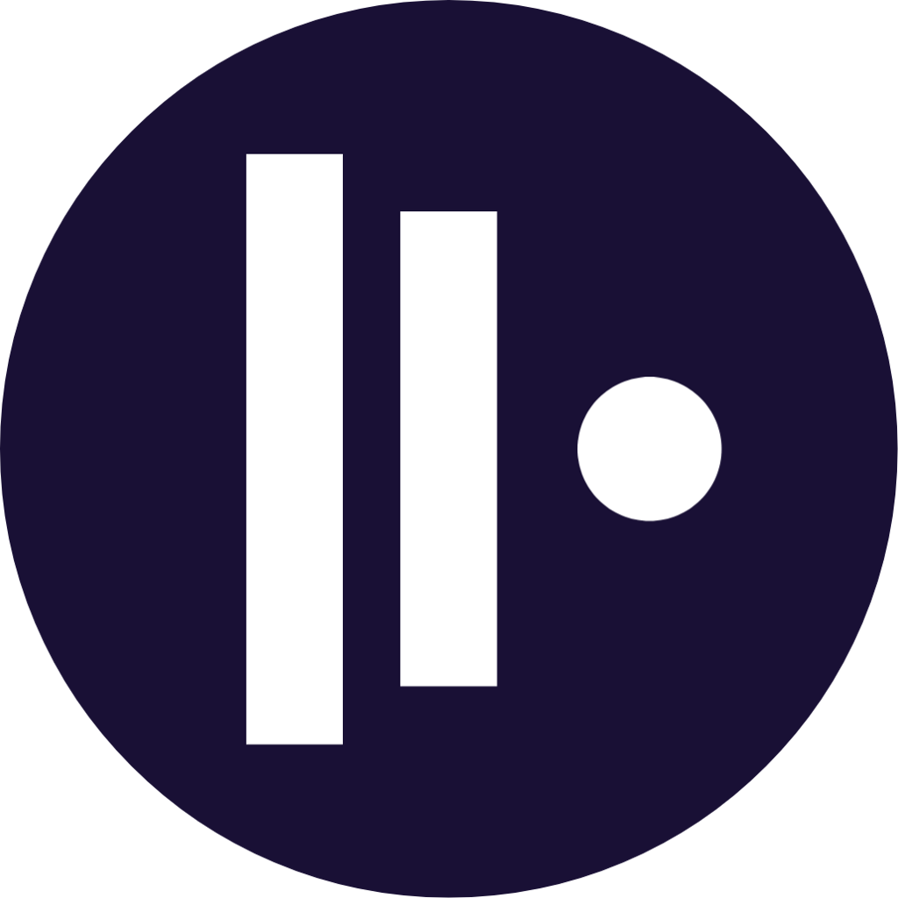

<br />
<br />

<p align="center">
    
</p>

<br />

<h1 align="center">Canvas</h1>
<h2 align="center">AI-powered context layer on top of your unstructured universe!</h2>

<br />


---
**Codebase cleanup/migration in-progress! Warning! Might hurt your eyes :)**  

---
<br />

## Installation instructions

Install the developer-friendly (and currently the only) version  
```
$ git clone git@github.com:idncsk/canvas.git
$ cd canvas/app
$ npm install
$ npm run canvas
# Optionally, add canvas/bin to your $PATH
```

For portable use, download and extract nodejs and electron into the canvas/runtime folder
- Symlink electron-vNN-linux-x64 to electron-linux-x64
- Symlink node-vNN-linux-x64 to node-linux-x64

To install the firefox browser extension:

- Open your browser and navigate to
**about:debugging#/runtime/this-firefox**
- Click on "Load Temporary Add-on"
- Navigate to canvas/ext/browser/firefox

To install the bashrc wrapper:
- Update your ~/.bashrc to source ``/path/to/canvas/ext/bash/context.sh``

<br />

## Configuration paths

Global app config: ``canvas/config``  
Default user home for portable use: ``canvas/user``  
default user home: ``$HOME/.canvas``

<br />

## Basic concepts
You use Canvas to divide your work / workflows and **data**(regardless of its location) into separate "contexts". Contexts are stored as a tree structure resembling a file-system hierarchy:

```
universe://
    CustomerA
        /Devel
            /JIRA-1234
        /Reports
            /Compliance
                /2022
                /2023
        /Infrastructure
            /DC Frankfurt
                /dmz
                    /wsa
                    /..
    CustomerB
        /Projects
            /2022
                /Rand PoC
                /..
    Billing
        /My LLC A
            /2022
            /2023
            /Contracts
            /...
        /My LLC B
    Home
        /New House
            /Heating
            /Electricity
            /Kitchen
                /Sinks
                /Materials
                    /Shinnoki
                    /Egger
                    /..
            /Project docs
                /Archicad
                /Sketchup
        /Music
        /..
```
Every path in this tree represents a context url  
- ``universe://home/ournewhouse/heating``  
- ``universe://billing/llca/contracts``

Every context *url part* represents a layer. Layers are of 4(5) types:

- **Workspace**: Exportable, shareable collection of layers and data sources. By default, this is your "universe".  

- **Canvas**: A multi-context layer that links to feature and filter bitmaps and (optionally) stores Canvas UI layout and UI applet data. A good example would be ``universe://project_a/sec_cmpl/customer_a/dash``, which, besides inherently filtering the customer_a data could also link to
  - data/abstraction/tab OR data/abstraction/email OR data/abstraction/file OR data/abstraction/todo AND
  - filter/email/from/itsec-guy1@customer_a OR
  - filter/email/from/itsec@customer_a OR
  - (filter/email/from/@customer_a AND filter/email/subject/Compliance*) OR
  - data/source/deviceid://path/to/customer_a/reports/incoming
  
  When opened in the GUI, you would get a nice list of reports, incoming emails, **browser tabs** and todo items. A layer of type "canvas" loosely resembles a database view.
   
- **Context**: The **default layer type** that links a context url part to one and only one context bitmap. As an example, moving a layer called "reports" to the root "/" ("universe:///") would - in a standard bitmap-y fashion - show all data linked to the "reports" bitmap for the entire universe; moving/copying the same layer under universe://customer_a/reports would filter out only a subset related to customer_a. Ideally, you want to prevent having multiple layers representing the same data. Reports, reports_new, reports2, customera_reports should be represented by one layer called "reports", leaving the larger context(layer order) handle the rest for you
  
- **Filter**: Represents a single filter or feature bitmap, example: ``universe://customer_a/:emails/:today``, where :emails represents the "data/abstraction/email" feature bitmap, :today represents the "filter/timeline/today" filter.

- **Label**: A noop layer with no context or feature bitmap links

<br />

## Use cases
**To-be replaced by a video**  
TL;DR Version: You start working on a random DevOps task "A". You may start by opening your browser, doing some research, maybe downloading and extracting some files, making some notes. Then, another high-priority(tm) task "B" comes along! Oook, n x (Ctrl+T), maybe move your previous tabs to your growing 2k+ entries OneTab list, do some more research, write some code snippets or configuration files, run some qemu and/or docker magic. Then! your carpenter calls! asking a few unpleasant questions about - lets say, your kitchen - that you were to answer during the last weekend. You put all the above aside and quickly start looking through your bookmarks and your by now severely trashed downloads folder ..for that one visualization you wanted to send him.

Now imagine the same with Canvas:

- You start your work by creating a context called **customer/dev/taskA**(replace with jira-1234 or INC1234 if you like). This will store and close your current browser tabs, cleanup your desktop and downloads folders, todo, calendar and notes - so that you can start working on a clean "table", or "desk-top" :)
- Once task "B" comes along, knowing you have all your work stored and indexed, you create another context **customer/dev/taskB**  and start working on that one
- When your carpenter calls, you just switch to **New House/Kitchen** which will load all related tabs, populate a webdav-based desktop folder showing you (aot) that pdf you would be searching for otherwise, displaying a font 22 note on your sidebar "Send till Monday!" and all the reminder emails you missed from the carpenter.

<br />

## Social
I'm trying to motivate myself to do daily code updates by doing not-yet-but-soon-to-be live coding sessions (usually ~5AM - 6AM CEST). Wouldn't watch any of the existing videos _yet_, mostly OBS audio tests and a showcase of sleep deprivation, but you can subscribe for updates nevertheless.

YT Channel + Some (royalty-free) muzzick
- https://www.youtube.com/@idnc.streams 
- https://soundcloud.com/idnc-sk/sets


<br />

## Support this project

- **By contributing to the codebase**
- **By testing the application and reporting bugs**
- By subscribing to the YT channel above

  **or**, by sponsoring some quality coffee via
- <https://opencollective.com/idncsk>
- <https://www.buymeacoffee.com/idncsk>
- A monthly recurring payment of 1EUR (I tolerate some margin of error:) to IBAN SK95 8330 0000 0023 0250 2806

Any suggestions welcome ("you should use \<module\> to do \<stuff\> instead of \<whatever nightmare you have currently implemented\>"), as a non-programmer this is really appreciated!


Thank you!
