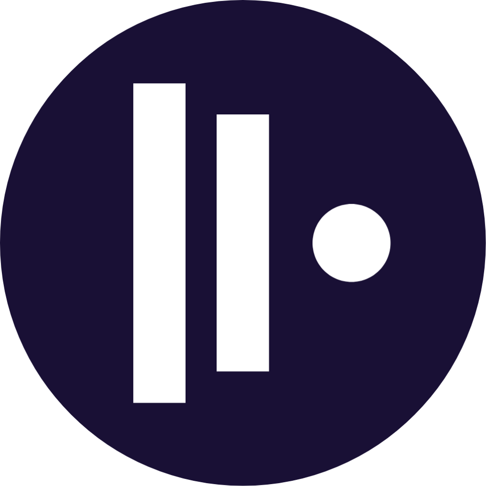

<br />
<br />

<p align="center">
    
</p>

<br />

<h1 align="center">Canvas</h1>
<h2 align="center">AI-powered context layer on top of your unstructured universe!</h2>

<br />


---
**Codebase cleanup/migration in-progress! Warning! Might hurt your eyes :)**

As time is the most precious resource one can waste and I want to have the core functionality ready till EO 08/2023, I'll be experimenting with a couple of paid contribution models.

**Resolution of issues labeled as "Paid" will be paid for after your PR is approved and merged**

Features that are not on the roadmap or need to be re-prioritized will be voted on, estimated and implemented based on the amount of funds reserved.

---
<br />

## Basic Concepts / What is Canvas

Canvas is a cross-platform(linux, macos, windows) desktop overlay to help you organize your work / workflows and **data**(regardless of its type and location) into separate "contexts".

Contexts are stored as a tree structure resembling a file-system hierarchy:

```
universe://
    Work
        /Customer A
                /Devel
                    /JIRA-1234
                    /JIRA-1235
                /Reports
                    /Compliance
                        /2022
                        /2023
        /Infrastructure
            /DC Frankfurt
                /network
                /overview
        Billing
            /acme llc
                /2022
                /2023
                /Contracts
                /...
            /acme inc
    Home
        /Music
        /Podcasts
            /Physics*
            /Medicine**
        /Library
            /Physics*
            /Math
            /Medicine**
        /Our new house
            /Heating
            /Electricity
            /Kitchen
                /Sinks
                /Materials
                    /Shinnoki
                    /Egger
                    /..
            /Project docs
                /Archicad
                /Sketchup
    Edu
        /Medicine**
        /Physics*
```
Every path in this tree can be represented by a context url
- ``universe://library/physics``
- ``universe://work/billing/acme_llc/contracts``

Every context tree leaf / context url part represents a layer. There are 5 types of layers:

- **Workspace**: Exportable, shareable collection of layers and data sources. By default, you start with an undifferentiated "universe". Even though color plays a huge role in our perception of reality, its quite underused in todays UI design. Workspaces in Canvas can have a primary color assigned, If they do, Canvas will automatically use gradients [of the primary workspace color] for individual data abstractions. This visual hint will make searching through your universe easier (and more fun). As you might have guessed, the default primary color of the universe is white(dispersive prisms are cool :)

- **Canvas**: A layer with multiple context, feature and/or filter bitmaps assigned that (optionally) stores Canvas UI layout and UI applet data.

- **Context**: The default layer type that links a context url part to one and only one context bitmap. Moving a layer called "reports" to the root "/" ("universe:///") will - in a standard bitmap-y fashion - show all data linked to the "reports" bitmap for the entire universe; moving/copying the same layer under universe://customer_a/reports will filter out only a subset related to customer_a. Ideally, you want to prevent having multiple layers representing the same data. "Reports", "reports_new", "reports2", "customera_reports" should be represented by one layer called "reports", leaving the larger context(layer order) handle the filtering for you.

- **Filter**: Represents a single filter or feature bitmap; example: ``universe://customer_a/:emails/:today``, where :emails represents the "data/abstraction/email" feature bitmap, :today represents the "filter/timeline/today" filter.

- **Label**: A noop layer with no context or feature bitmap links

<br />

## Installation instructions

Install the developer-friendly (and currently the only) version
```
$ git clone git@github.com:idncsk/canvas.git
$ cd canvas/app
$ npm install
$ npm run canvas
# Optionally, add canvas/bin to your $PATH
```

For portable use, download and extract nodejs and electron into the canvas/runtime folder
- Symlink electron-vNN-linux-x64 to electron-linux-x64
- Symlink node-vNN-linux-x64 to node-linux-x64

To install the firefox browser extension:

- Open your browser and navigate to
**about:debugging#/runtime/this-firefox**
- Click on "Load Temporary Add-on"
- Navigate to canvas/ext/browser/firefox

To install the bashrc wrapper:
- Update your ~/.bashrc to source ``/path/to/canvas/ext/bash/context.sh``

<br />

## Configuration paths

Global app config: ``canvas/config``
Default user home for portable use: ``canvas/user``
default user home: ``$HOME/.canvas``

<br />

## Social
I'm trying to motivate myself to do daily code updates by doing not-yet-but-soon-to-be live coding sessions (usually ~5AM - 6AM CEST). Wouldn't watch any of the existing videos _yet_, mostly OBS audio tests and a showcase of sleep deprivation, but you can subscribe for updates nevertheless.

YT Channel + Some (royalty-free) music
- https://www.youtube.com/@idnc.streams
- https://soundcloud.com/idnc-sk/sets


<br />

## Support this project

- **By contributing to the codebase**
- **By testing the application and reporting bugs**
- By subscribing to the YT channel above

  **or**, by sponsoring some quality coffee via
- <https://opencollective.com/idncsk>
- <https://www.buymeacoffee.com/idncsk>
- A monthly recurring payment of 1EUR (I tolerate some margin of error:) to IBAN SK95 8330 0000 0023 0250 2806

Any suggestions welcome ("you should use \<module\> to do \<stuff\> instead of \<whatever nightmare you have currently implemented\>"), as a non-programmer this is really appreciated!


Thank you!
